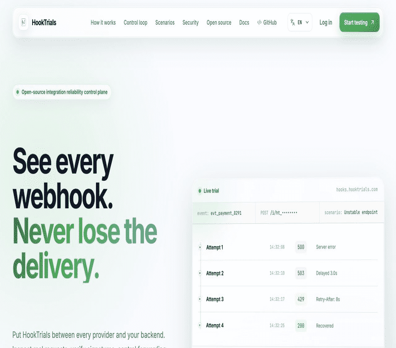
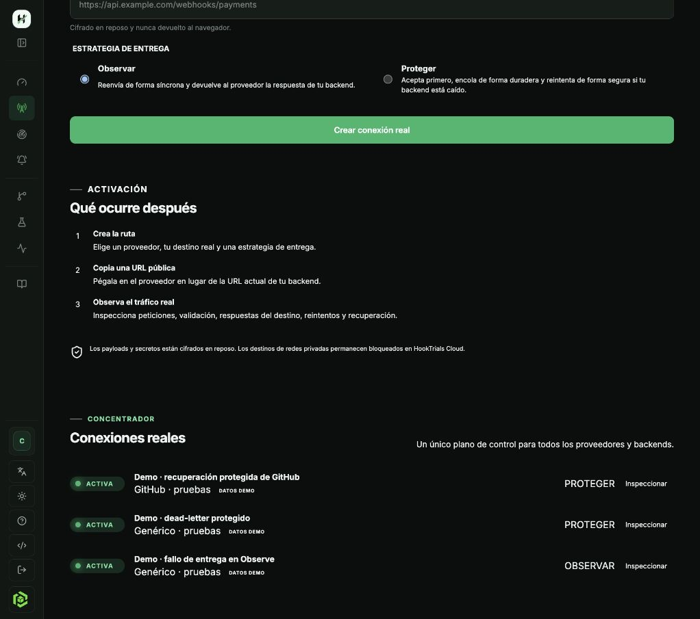
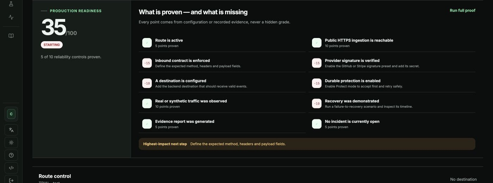
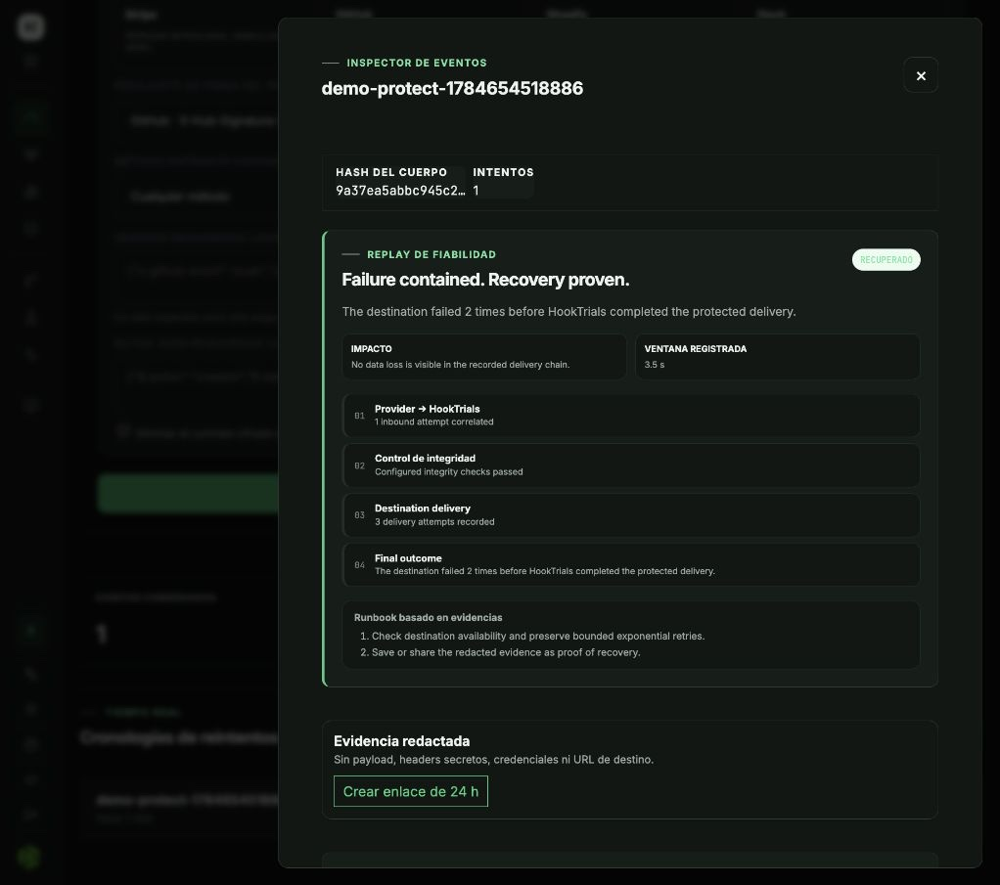

# HookTrials

[](https://cubepath.com/)
[](docs/release-status.md)
[](LICENSE)

Open-source integration reliability control plane. HookTrials tests failure behavior, safely
operates webhook delivery and monitors APIs, HTTP routes and destinations from one dashboard.

> Your webhook works when everything goes right. HookTrials tests everything else.

Current public release: **v0.11.2** (21 July 2026). The managed sandbox is available at
[app.hooktrials.com](https://app.hooktrials.com); use synthetic payloads whenever possible.

## Run locally

Requirements: Docker Engine, Docker Compose v2 and OpenSSL.

```bash
git clone https://github.com/IKER-36/hooktrials.git
cd hooktrials
./hooktrials up
```

Open `http://localhost:3000`. First account becomes installation administrator; public registration
then closes. Self-hosted mode has no endpoint or daily-event quota by default.

```bash
./hooktrials status
./hooktrials logs
./hooktrials backup
./hooktrials update
```

To receive webhooks from external providers, configure your existing HTTPS proxy or let the
included Caddy profile manage a public domain:

```bash
./hooktrials configure proxy https://trials.example.com 3000
# or: ./hooktrials configure domain trials.example.com operator@example.com
./hooktrials up
./hooktrials doctor --external
```

See [External access](docs/external-access.md) for DNS, Cloudflare, firewall and tunnel guidance.

Runtime secrets are generated once inside ignored `.hooktrials/runtime.env` with restrictive file
permissions. Never delete or rotate `PAYLOAD_ENCRYPTION_KEY` while encrypted payloads exist.

## Included

- React dashboard, login and first-run setup. No marketing landing.
- Complete English and Spanish interface, persisted per browser and available on public pages.
- Contextual product tour that keeps each live module visible, with a permanent restart control.
- Searchable in-product Docs with exact workflows, outcomes and troubleshooting.
- Persistent accessible light and dark themes built from a sober, solid semantic design system.
- Unified Control Center, integration inventory and Operations recovery queue.
- Explicit Product / Lab / Resources workspaces, keeping real Observe/Protect connections separate
  from synthetic Trial endpoints and failure scenarios.
- Open operational layouts based on typography, whitespace and data dividers instead of repetitive
  floating cards, with the same hierarchy on desktop and mobile.
- One-click Guided Demo filling every product module with an isolated, realistic synthetic workspace,
  including clearly labelled Observe and Protect connections in Webhook Hub.
- Fastify API and isolated public ingestion service.
- Background analysis and retention worker.
- PostgreSQL migrations and Redis/BullMQ processing.
- Deterministic `500`, `503`, `429` and recovery scenarios.
- Failure scenarios for custom multi-step status, delay, header and body recipes.
- Guided endpoint templates and an integrated provider simulator.
- Live event stream, retry timeline and encrypted payload inspector.
- Reliability Replay turning each event into a causal diagnosis, impact statement and runbook.
- Attempt comparison for status, latency, headers, payload stability, signature and contract state.
- Trial, Observe and Protect route modes with contracts and GitHub/Stripe signatures.
- Webhook Hub for atomic real-provider onboarding, complete request interception and centralized
  delivery operations.
- Stripe, GitHub, Shopify and Slack provider starters inside route configuration.
- Durable retries, dead-letter recovery, incidents, outgoing alerts and redacted evidence links.
- Editable HTTP/HTTPS and ICMP monitoring with explainable availability, latency and integrity
  scores.
- Explainable production-readiness score with a highest-impact next action for every route.
- Customizable public status pages that combine selected monitors, branding, 24-hour metrics and
  incident history behind a revocable URL.
- Single-origin self-hosting through Docker Compose.
- Terminal CLI and reusable GitHub Action for deterministic reliability trials in CI.

## One-click full product demo

After signing in, open **Guided demo** and select **Run full demo**. HookTrials creates and exercises a
complete synthetic workspace instead of showing static sample cards:

- a custom cascading-outage scenario and a `500 → 503 → 429 → 200` Trial timeline;
- separate Observe and Protect routes with destination evidence, durable retries and recovery;
- a GitHub-shaped Protect event with a valid HMAC signature, enforced inbound contract and a
  production-readiness result based entirely on recorded evidence;
- five monitors covering an external API, internal API, HTTP route, webhook destination and ICMP
  host, plus a public page combining HTTP and ICMP evidence;
- healthy, degraded, down and recovered monitor states with latency and availability history;
- an exhausted protected delivery in the dead-letter inbox, ready for replay or discard;
- open and recovered incidents, protected deliveries and safe synthetic alert-audit entries;
- one redacted evidence report with an expiring share link.

Every generated resource belongs to the signed-in account and receives a private run identifier.
**Clean only this demo run** removes that exact workspace without matching names or touching other
user data. Demo incidents never call a real alert webhook configured by the user.

See [Guided Demo](docs/demo-lab.md) for the generated dataset, safety boundary and cleanup model.

## Why HookTrials is different

Request bins show what arrived. Uptime tools show whether one URL responds. HookTrials connects the
complete reliability loop: deliberately break an integration, separate provider-side failure from
destination failure, protect delivery, observe recovery and preserve shareable evidence.

**Reliability Replay** turns the recorded chain into a deterministic explanation. **Production
Readiness** scores only controls and evidence the user can inspect. Neither feature invents an AI
conclusion or hides a grading formula.

### See the product, not a mock-up

The current `v0.11.2` interface keeps real delivery work in **Product** and deterministic
experiments in **Lab**. These captures come from the deployed Cloud application; the same dashboard
is included in the self-hosted distribution.









## Repository model

This public repository contains the complete self-hosted product. Managed hosting operations and
the marketing website are outside its scope and are not required to run HookTrials locally.

## Documentation

- [Getting started](docs/getting-started.md)
- [Trial, Observe and Protect](docs/trial-mode.md)
- [Webhook Hub and real traffic](docs/live-webhook-hub.md)
- [Monitoring](docs/monitoring.md)
- [Languages](docs/internationalization.md)
- [Reliability Replay](docs/reliability-replay.md)
- [Production readiness](docs/production-readiness.md)
- [Public status pages](docs/public-status-pages.md)
- [Contracts and signatures](docs/contracts-and-signatures.md)
- [Incidents, alerts and evidence](docs/incidents-alerts-evidence.md)
- [Architecture](docs/architecture.md)
- [Guided demonstration](docs/guided-demo.md)
- [Guided Demo](docs/demo-lab.md)
- [CLI and GitHub Actions](docs/cli-and-ci.md)
- [Competition demonstration script](docs/competition-demo.md)
- [Failure scenarios](docs/scenario-studio.md)
- [Self-hosting](docs/self-hosting.md)
- [Configuration](docs/configuration.md)
- [Development](docs/development.md)
- [Security](docs/security.md)
- [Current release status](docs/release-status.md)

## Source development

```bash
corepack enable
pnpm install
pnpm check
pnpm dev
```

## License

HookTrials is licensed under the [GNU Affero General Public License v3.0](LICENSE), using the
`AGPL-3.0-only` SPDX identifier. Modified versions made available over a network must offer their
corresponding source code to users.
